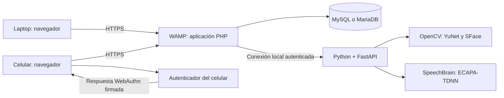
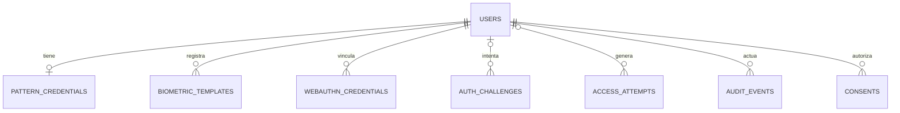

# IAW-UNI2 · ADA 1: investigación y plan de trabajo

**Equipo:** cuatro integrantes. **Entrega:** 28 de septiembre de 2026, 23:59. **Consulta:** 25 de septiembre de 2026.

**Estado:** arquitectura investigada y confirmada por el equipo; todavía no es una aplicación implementada ni un manual de instalación verificado. Se ajusta a la aclaración del equipo: WAMP, reconocimiento real y uso de un celular para la huella.

## 1. Arquitectura confirmada

Construir una aplicación propia en **PHP, HTML, CSS y JavaScript**, con **MySQL o MariaDB**, servida por WAMP. Utilizar un único servicio auxiliar local en **Python y FastAPI** para ejecutar **OpenCV YuNet + SFace** y **SpeechBrain ECAPA-TDNN**. Implementar huella mediante **WebAuthn** y una biblioteca PHP. Construir el patrón con JavaScript y validarlo en PHP.

Esta es una decisión de arquitectura confirmada por el equipo, no una exigencia literal del enunciado. Evita entrenar modelos desde cero y permite realizar la inferencia facial y vocal en el servidor, en lugar de aceptar un resultado de autenticación declarado por el navegador.

**Alcance confirmado por el equipo:** se permite una aplicación principal en PHP apoyada por un servicio biométrico local Python y la demostración de huella del dispositivo mediante WebAuthn. El usuario confirmó expresamente ambas decisiones en esta conversación. No queda pendiente volver a solicitar esa confirmación.

La implementación puede avanzar con esa arquitectura. Quedan por verificar la compatibilidad del teléfono, HTTPS y el funcionamiento de los modelos en el equipo real. No se recomienda improvisar una comparación de volumen, tono o transcripción y presentarla como verificación biométrica real.

No se propone simulación como sustituto de los cuatro métodos. Las respuestas ficticias solo podrán usarse para construir y probar la interfaz; deben estar separadas de la aplicación que se presenta.

## 2. Qué se está autenticando

- **Identificar:** buscar a una persona entre todas las registradas, comparación 1:N.
- **Verificar:** comprobar que la muestra corresponde a la cuenta indicada, comparación 1:1.
- **Autorizar:** decidir qué puede hacer una cuenta ya autenticada.

Para este proyecto recomendamos **seleccionar método → escribir identificador → verificar 1:1 → iniciar sesión → aplicar permisos**. Es más sencillo de evaluar que identificar rostros o voces entre toda la base. Los roles son exactamente `Administrator` y `Gestor`.

Ofrecer cuatro alternativas es autenticación multimodal. No significa que todos los accesos sean multifactor: para eso deben combinarse factores distintos en un mismo acceso.

## 3. Herramientas y funcionamiento de cada método

### 3.1 Rostro: OpenCV, YuNet y SFace

**Qué hace cada pieza:** YuNet detecta el rostro; SFace extrae sus características para compararlas. Detectar una cara no identifica a su propietario. OpenCV documenta ambas etapas y sus interfaces de Python. [Tutorial oficial de OpenCV](https://docs.opencv.org/4.13.0/d0/dd4/tutorial_dnn_face.html).

**Registro propuesto:** el administrador crea la cuenta; el titular acepta el uso académico y captura tres imágenes con pequeñas variaciones de postura e iluminación. El navegador envía las imágenes por HTTPS a PHP. PHP valida tamaño y formato y llama al servicio local. Este rechaza imágenes sin rostro o con varios rostros, alinea la cara y extrae plantillas numéricas. Las plantillas se cifran antes de persistirlas. Las imágenes originales se descartan después del procesamiento salvo que exista una necesidad académica acordada y documentada.

**Acceso propuesto:** el usuario indica su cuenta y captura una imagen nueva. El servicio extrae otra plantilla y calcula una puntuación de similitud contra las referencias de esa cuenta. PHP comprueba el resultado, el estado de la cuenta y los límites de intentos antes de abrir la sesión. Las referencias nunca se entregan al navegador.

**Límites:** reconocimiento real no equivale a prueba de vida. Una fotografía, video o cámara virtual puede presentar riesgos. Un gesto o parpadeo sencillo tampoco acredita resistencia certificada a suplantación. Deben explicar esa limitación y probarla; no anunciar protección que no hayan implementado y medido.

La documentación publica umbrales obtenidos en conjuntos de evaluación. No son una precisión garantizada para el equipo. Deben separar capturas de registro, calibración y evaluación, fijar el umbral antes de la prueba final y guardar su versión.

**Fundamento académico:** Zhong y colaboradores describen SFace en IEEE Transactions on Image Processing (2021); existe una versión accesible depositada en arXiv en 2022. [Artículo y referencia editorial](https://arxiv.org/abs/2205.12010).

### 3.2 Voz: SpeechBrain y ECAPA-TDNN

La propuesta utiliza **verificación del hablante**: comparar características de la voz de una persona. SpeechBrain proporciona un modelo ECAPA-TDNN y ejemplos de verificación entre grabaciones. Su ficha especifica audio de 16 kHz y un canal, y advierte que los resultados en otros datos no están garantizados. [Ficha oficial del modelo](https://huggingface.co/speechbrain/spkrec-ecapa-voxceleb).

**Registro propuesto:** tres grabaciones independientes de 5 a 8 segundos por participante, como punto inicial del proyecto, no como requisito del modelo. Se captura con `getUserMedia` y `MediaRecorder`. El servidor decodifica el formato realmente recibido, transforma a mono/16 kHz y extrae plantillas. Debe detectar silencio, saturación evidente, duración excesiva y archivos inválidos. Se necesitan pruebas con el idioma, micrófonos y ruido reales del equipo.

**Acceso propuesto:** capturar otra grabación, comparar su representación con las plantillas de esa cuenta y aplicar un umbral previamente calibrado. El servicio solo devuelve el resultado a PHP. Un servicio caído debe producir error, nunca acceso concedido.

**Lo que no sirve como sustituto:** `SpeechRecognition` de Web Speech convierte voz en texto. Una frase correcta puede ser pronunciada por otra persona. Además, según navegador, el audio puede procesarse en un servicio externo. [Documentación de MDN](https://developer.mozilla.org/en-US/docs/Web/API/SpeechRecognition).

**Límites:** ECAPA-TDNN por sí solo no acredita que una grabación sea en vivo ni que no sea clonada. Una frase aleatoria solo aporta una comprobación adicional si el sistema verifica realmente su contenido; no basta con mostrarla. Para el alcance inicial se propone verificación vocal real, sin afirmar defensa contra replay o clonación.

NIST SP 800-63B-4 excluye la comparación biométrica basada en voz dentro de sus requisitos de autenticación. Esto sirve para contextualizar las limitaciones del prototipo académico; no es una prohibición general de investigar el tema ni una ley mexicana. No presenten el proyecto como conforme a NIST. [NIST, sección sobre biometría](https://pages.nist.gov/800-63-4/sp800-63b.html#biometric).

**Fundamento académico:** Desplanques, Thienpondt y Demuynck (2020), ECAPA-TDNN, Interspeech, pp. 3830–3834. [Artículo en ISCA](https://www.isca-archive.org/interspeech_2020/desplanques20_interspeech.html).

### 3.3 Huella: WebAuthn y autenticador del dispositivo

Utilizar `navigator.credentials.create()` para registrar una credencial y `navigator.credentials.get()` para autenticar. PHP verifica los mensajes con `lbuchs/webauthn`. La biblioteca requiere PHP 8 o superior, OpenSSL y mbstring; es MIT. [Repositorio oficial](https://github.com/lbuchs/WebAuthn).

La huella se registra en la configuración del teléfono, no en la aplicación PHP. La aplicación registra **una credencial de clave pública vinculada a la cuenta**. En el acceso, el autenticador firma un reto después de la verificación local. El servidor no recibe imágenes de huella ni la clave privada. [Especificación W3C](https://www.w3.org/TR/webauthn-2/).

**Limitación decisiva:** pedir `userVerification: "required"` no obliga a usar específicamente huella. La verificación local puede emplear PIN, rostro u otro mecanismo permitido por el autenticador. La prueba `isUserVerifyingPlatformAuthenticatorAvailable()` informa disponibilidad de un autenticador, no existencia de un sensor de huella. [MDN](https://developer.mozilla.org/en-US/docs/Web/API/PublicKeyCredential/isUserVerifyingPlatformAuthenticatorAvailable_static).

Por ello la tarjeta debe decir **“Huella digital”** y aclarar **“Mediante el dispositivo; puede ofrecer otro método de desbloqueo”**. En el manual: “Autenticación WebAuthn demostrada con huella en el dispositivo utilizado”. Si la demostración termina usando PIN, no deben registrarla como prueba de huella.

**Necesitan:** un celular con sensor, huella ya configurada, navegador compatible y HTTPS confiable. Un iPhone con Face ID pero sin Touch ID no aporta un sensor de huella. Una animación o tocar la pantalla no reemplaza el lector. Si ningún integrante tiene un equipo adecuado, necesitarán conseguir uno prestado para esa prueba.

El registro de la credencial en la cuenta debe realizarse en una sesión de alta autorizada y acotada. No debe existir una ruta pública que permita agregar una credencial a cualquier `user_id`.

### 3.4 Patrón: JavaScript y hash de PHP

Implementar una cuadrícula 3×3 accesible por ratón, tacto y teclado, sin depender de un complemento antiguo. Propuesta: 6 a 9 puntos distintos; se registra únicamente la secuencia explícitamente seleccionada. No se insertan puntos intermedios automáticamente. Esta regla debe ser idéntica en interfaz, servidor y manual.

Enviar la secuencia a PHP por HTTPS y guardarla usando `password_hash`, con verificación mediante `password_verify`. Preferir Argon2id si está disponible; documentar el algoritmo realmente usado. Guardar el hash en una columna de 255 caracteres. Nunca guardar el patrón en texto, en logs o en almacenamiento del navegador. [Manual PHP](https://www.php.net/manual/en/function.password-hash.php).

El patrón es un secreto de conocimiento, no biometría, y tiene un espacio limitado de combinaciones. Debe acompañarse de controles de intentos. La investigación sobre ataques por rastros en pantallas también sirve para discutir sus limitaciones. [Aviv et al., USENIX WOOT 2010](https://www.usenix.org/conference/woot10/smudge-attacks-smartphone-touch-screens).

## 4. Arquitectura propuesta

PHP es responsable de usuarios, roles, validaciones, retos, sesiones, autorización y registros. Python procesa imagen/audio y responde únicamente a PHP, sin gestionar roles ni crear sesiones. El servicio auxiliar escucha en `127.0.0.1`, con una clave de servicio fuera del repositorio. El celular nunca llama directamente al puerto de Python.

El navegador captura medios y muestra estados; no decide si la persona está autenticada. Rechazar diseños donde envía `authenticated: true`, el rol, el usuario ya validado o una puntuación como prueba suficiente.

FastAPI es una herramienta Python para exponer esta pequeña API local. [Documentación del proyecto](https://fastapi.tiangolo.com/).

## 5. Cómo usar el celular con WAMP

El celular puede ofrecer cámara, micrófono y autenticador; la laptop puede ofrecer cámara y micrófono. Debe detectarse capacidad y permiso, no asumirlo por el tipo de dispositivo. El patrón puede funcionar en ambos.

`getUserMedia` requiere un contexto seguro. `localhost` tiene un tratamiento especial, pero en el celular `localhost` es el propio teléfono. Abrir `http://192.168.x.x` no equivale a usar `localhost` seguro en la laptop. [MDN sobre cámara y micrófono](https://developer.mozilla.org/en-US/docs/Web/API/MediaDevices/getUserMedia).

**Ruta preferida para mantener datos en la red local:**

1. Conectar laptop y celular a una red de confianza que permita comunicación entre dispositivos.
2. Fijar una IP local para la laptop y un nombre, por ejemplo `auth.ada.test`, resoluble desde ambos dispositivos mediante DNS local. Editar solo el archivo hosts de Windows no resuelve el nombre para el teléfono.
3. Configurar un VirtualHost HTTPS de Apache que sirva únicamente la carpeta `public/` de la aplicación.
4. Emitir un certificado de desarrollo para ese nombre, por ejemplo con mkcert, e instalar la confianza de su CA en los dispositivos de prueba. Comprobar en cada navegador que no hay error de certificado. mkcert genera certificados, pero no configura Apache por sí mismo. Compartir solo el certificado público de la CA; nunca `rootCA-key.pem`. [Repositorio de mkcert](https://github.com/FiloSottile/mkcert).
5. Permitir acceso de la red local únicamente al sitio de demostración; conservar phpMyAdmin y el servicio Python restringidos. No desactivar globalmente el firewall.
6. Configurar origen exacto `https://auth.ada.test` y RP ID `auth.ada.test`; no incluir protocolo, ruta ni puerto en el RP ID. No usar una IP como sustituto improvisado del dominio para WebAuthn.
7. Registrar credenciales después de fijar este origen. Usar el mismo nombre durante registro, pruebas y video. Las credenciales creadas para `localhost` no se trasladan automáticamente a otro dominio.

**Alternativa si no pueden configurar DNS/certificados:** un túnel HTTPS puede publicar temporalmente el sitio local. Los Quick Tunnels de Cloudflare asignan un subdominio aleatorio y están destinados a pruebas. Esto introduce internet, un proveedor externo y exposición pública; debe acordarse antes de transmitir biometría. El origen debe permanecer estable durante registro y demostración. Si cambia, reconfigurar y registrar nuevamente las credenciales afectadas. No es la ruta local privada anterior. [Documentación de Cloudflare](https://developers.cloudflare.com/cloudflare-one/networks/connectors/cloudflare-tunnel/do-more-with-tunnels/trycloudflare/).

**Prueba prioritaria del primer día:** crear y verificar una credencial WebAuthn real desde el teléfono contra PHP. Hacer esto antes del trabajo visual detallado permite descubrir incompatibilidades de sensor, navegador y HTTPS.

## 6. Base de datos: diseño conceptual

Se entrega un diseño para convertir posteriormente en migraciones y SQL probado, no una base ya implementada.

| Tabla | Campos principales | Propósito |
|---|---|---|
| `users` | id, identifier UNIQUE, name, role, active, password_hash, session_version, created_at, updated_at | Cuentas; rol limitado a Administrator/Gestor. |
| `pattern_credentials` | user_id UNIQUE FK, pattern_hash, updated_at | Patrón protegido. |
| `biometric_templates` | id, user_id FK, modality, ciphertext, nonce, key_version, model_version, threshold_version, created_at, revoked_at | Plantillas cifradas de rostro/voz; nunca una huella cruda. |
| `webauthn_credentials` | id, user_id FK, credential_id UNIQUE, public_key, sign_count, transports, backup_eligible, backup_state, created_at, revoked_at | Credenciales del autenticador. |
| `auth_challenges` | id, user_id FK nullable, session_binding, purpose, method, challenge, expires_at, consumed_at | Retos efímeros ligados a sesión, cuenta, método y operación. |
| `access_attempts` | id, user_id FK nullable, identifier_digest, method, outcome, reason_code, ip_digest, created_at, request_id | Éxitos, fallos y errores técnicos; sin muestras ni secretos. |
| `audit_events` | id, actor_id FK, target_user_id FK nullable, action, created_at, request_id | Altas, cambios de rol, activación y revocaciones. |
| `consents` | id, user_id FK, modality, notice_version, granted_at, withdrawn_at | Autorización informada para las pruebas biométricas. |

Las relaciones opcionales permiten registrar intentos contra identificadores inexistentes. Para digests de IP/identificador usar HMAC con clave del servidor, no hashes simples previsibles. Los retos se consumen atómicamente. Puede mantenerse la sesión PHP en su almacén habitual y usar `session_version` para revocación; no es imprescindible crear una tabla adicional de sesiones.

Al cambiar un modelo, sus plantillas pueden dejar de ser compatibles: versionarlas y requerir nuevo registro cuando corresponda. Para credenciales WebAuthn, seguir el tratamiento de contadores y credenciales sincronizadas de la biblioteca; no rechazar indiscriminadamente todo contador cero.

## 7. Seguridad y evidencias exigibles

| Requisito | Decisión propuesta | Evidencia que deben producir |
|---|---|---|
| Roles | Validar en PHP en cada operación; denegar por defecto. | Gestor recibe 403 al intentar administrar directamente. |
| Hash de contraseñas | `password_hash`/`password_verify`, preferencia Argon2id. | Cuenta de prueba y base sin contraseña ni patrón en claro. |
| SQL Injection | PDO y parámetros; listas permitidas para nombres de columnas/orden. | Entradas maliciosas no alteran consulta ni autorizan. |
| Sesiones | Renovar ID al autenticar; cookies HttpOnly, Secure en HTTPS y SameSite; expiración y cierre. | Cookie inspeccionada, logout efectivo y sesión antigua invalidada. |
| Desactivación | Revalidar active/role y versión de sesión en peticiones protegidas. | Una cuenta desactivada pierde también la sesión abierta. |
| CSRF y XSS | Token CSRF en operaciones de cambio y autenticación; escape contextual de salida. | Solicitudes sin token rechazadas; nombres no ejecutan HTML. |
| Intentos | Límite por cuenta y origen, compartido entre modalidades. | No se elude cambiando de patrón a voz o viceversa. |
| Biometría | Cifrado autenticado; llave fuera de base y repositorio. | Esquema de almacenamiento y flujo de borrado. |
| WebAuthn | Validar reto, origen, RP ID, firma, UV y pertenencia de credencial. | Reto usado, vencido o de otra cuenta no autentica. |
| Cargas | Decodificar medios, límites de peso/duración, nombres generados y almacenamiento no público. | Archivo falso o excesivo rechazado. |
| Registro | Eventos suficientes, sin patrones, cookies, audio, imágenes ni plantillas. | Historial de éxito/fallo revisable por Administrator. |

Referencias de implementación: [PDO](https://www.php.net/manual/en/pdo.prepared-statements.php), [autorización OWASP](https://cheatsheetseries.owasp.org/cheatsheets/Authorization_Cheat_Sheet.html), [sesiones OWASP](https://cheatsheetseries.owasp.org/cheatsheets/Session_Management_Cheat_Sheet.html), [autenticación OWASP](https://cheatsheetseries.owasp.org/cheatsheets/Authentication_Cheat_Sheet.html), [cargas OWASP](https://cheatsheetseries.owasp.org/cheatsheets/File_Upload_Cheat_Sheet.html), [almacenamiento criptográfico OWASP](https://cheatsheetseries.owasp.org/cheatsheets/Cryptographic_Storage_Cheat_Sheet.html) y [logs OWASP](https://cheatsheetseries.owasp.org/cheatsheets/Logging_Cheat_Sheet.html).

Los parámetros de proyecto pueden empezar en cinco fallos por cuenta en diez minutos con espera temporal, pero deben probarse contra abuso y bloqueo injustificado. No se presentan como una configuración certificada. Usar el mismo mensaje público “Acceso no autorizado” para cuenta inexistente, desactivada o muestra incorrecta; el detalle va al registro privado. Los errores técnicos pueden informar “Micrófono no disponible” sin divulgar si una cuenta existe.

El alta inicial de Administrator debe hacerse mediante un comando local interactivo. No dejar credenciales por defecto ni una página pública de instalación. Impedir desactivar o degradar al último administrador activo.

Para cumplir explícitamente el requisito de contraseñas, incluir credenciales de recuperación/administración protegidas con hash y probar su uso. El acceso principal conserva las cuatro modalidades. Todo acceso de recuperación también registra intentos y respeta estado, permisos y límites.

## 8. Datos de prueba autorizados

Usar únicamente muestras de integrantes que hayan aceptado voluntariamente. Definir finalidad, responsables, ubicación, fecha de eliminación y cómo retirar consentimiento. Es una propuesta de manejo académico, no un dictamen jurídico.

No subir muestras, plantillas, claves, certificados privados o copias reales de la base a GitHub ni a prompts de IA. El repositorio debe contener esquema y datos ficticios no biométricos. Los modelos preentrenados son dependencias, no autorización para reutilizar libremente cualquier dataset o rostro de internet.

Propuesta de retención: descartar medios brutos al terminar cada procesamiento; conservar plantillas solo durante evaluación y plazo de revisión acordado; revocarlas y borrarlas al concluir. Desactivar una cuenta no equivale a borrar su biometría: deben existir acciones diferenciadas.

Para el video, usar nombres de demostración y encuadres que eviten mostrar secretos. Obtener autorización también para aparecer en él.

## 9. Repositorios: qué reutilizar

Se propone construir el sistema propio y reutilizar bibliotecas concretas. No se ha seleccionado una aplicación estudiantil completa para copiar. La revisión siguiente verificó procedencia, documentación, licencia y metadatos; no constituye una auditoría completa de seguridad de las bibliotecas ni una prueba de instalación.

| Componente | Uso | Licencia observada | Revisión observada |
|---|---|---|---|
| [opencv/opencv_zoo](https://github.com/opencv/opencv_zoo) | Modelos y ejemplos de rostro | Repo Apache-2.0; YuNet MIT; SFace Apache-2.0 | `47534e27c9851bb1128ccc0102f1145e27f23f98`, 28-05-2026 |
| [speechbrain/speechbrain](https://github.com/speechbrain/speechbrain) | Verificación vocal | Apache-2.0 | `89ead74d163463d30c62329a09cfdb4c54f5abc1`, 27-08-2026 |
| [speechbrain/spkrec-ecapa-voxceleb](https://huggingface.co/speechbrain/spkrec-ecapa-voxceleb) | Pesos de voz | Apache-2.0 en ficha | Fijar revisión y checksums al implementar. |
| [lbuchs/WebAuthn](https://github.com/lbuchs/WebAuthn) | Verificación WebAuthn en PHP | MIT | `fb4bcee0ea8a5bc25e5dc358172d65bf15b5f419`, 05-09-2025 |
| [fastapi/fastapi](https://github.com/fastapi/fastapi) | API biométrica local | MIT | `192b12197eb04c2b4a691cce7d87261b21716714`, 25-09-2026 |
| [FiloSottile/mkcert](https://github.com/FiloSottile/mkcert) | HTTPS de desarrollo | BSD-3-Clause | `1c1dc4ed27ed5936046b6398d39cab4d657a2d8e`, 18-04-2024 |

Las revisiones son referencias de investigación, no una instrucción para instalar las ramas de desarrollo. Seleccionar versiones estables compatibles y conservar `composer.lock`, dependencias Python fijadas y manifiesto de modelos al construir. La falta de commits recientes no prueba vulnerabilidad; tampoco las estrellas prueban seguridad.

**Alternativa facial evaluada:** [Human](https://github.com/vladmandic/human) es MIT y ofrece embeddings faciales en JavaScript. Puede servir para procesamiento local en navegador, pero hay que documentar que un cliente alterado puede falsificar sus resultados. Dado que ya se necesita Python para voz, se prefiere centralizar ambas inferencias allí. El `face-api.js` original es MIT y tiene ejemplos útiles, pero la revisión principal consultada era del 22-04-2020; no se selecciona como base nueva sin revisar mantenimiento y compatibilidad.

Conservar avisos de terceros y diferenciar en el manual código propio, adaptaciones y modelos. No atribuir al equipo el entrenamiento de modelos preexistentes.

## 10. Skills de skills.sh evaluadas

Una skill orienta al asistente de desarrollo; no se incorpora como método de autenticación ni sustituye una biblioteca. No se instaló ninguna.

Se revisaron las carpetas completas de las dos skills siguientes en el repositorio canónico `anthropics/skills`, commit **`33375500bcea98d610eb30ce10ac4e59b89c390d`**, del **24-09-2026**: instrucciones, licencias, ejemplos, script auxiliar y manifiesto de distribución. Ambas carpetas contienen licencia Apache-2.0. No se detectaron hooks ni servidores MCP dentro de esas carpetas.

| Skill | Utilidad | Dependencias y riesgos | Recomendación |
|---|---|---|---|
| [frontend-design](https://skills.sh/anthropics/skills/frontend-design) | Dirección visual y revisión de la interfaz para Gemini/Codex. | Paquete solo de instrucciones y licencia; puede orientar cambios de archivos. Sus preferencias estéticas deben ceder al brief, accesibilidad y PHP del proyecto. | Única skill externa recomendada inicialmente, opcional y local al proyecto. El prompt adjunto basta para empezar. |
| [webapp-testing](https://skills.sh/anthropics/skills/webapp-testing) | Recorridos de interfaz y capturas con Playwright. | Requiere Python, Playwright y navegador. El auxiliar ejecuta comandos con `shell=True` y termina procesos; ejemplos usan rutas Linux. No introducir comandos construidos con entrada no confiable. | Opcional después; adaptar a WAMP ya iniciado y rutas Windows. No usar su auxiliar para iniciar/parar el WAMP existente. |

Fuentes fijadas: [frontend-design revisada](https://github.com/anthropics/skills/tree/33375500bcea98d610eb30ce10ac4e59b89c390d/skills/frontend-design) y [webapp-testing revisada](https://github.com/anthropics/skills/tree/33375500bcea98d610eb30ce10ac4e59b89c390d/skills/webapp-testing).

La skill de pruebas recomienda tratar scripts como cajas negras; esa instrucción no debe reemplazar una revisión previa del paquete. No se observaron instrucciones explícitas para extraer credenciales, pero las pruebas pueden capturar datos sensibles en pantallas y logs. Usar datos de prueba. Su ejecución automatizada no demuestra que funcione un sensor físico de huella.

Si posteriormente se instala, usar únicamente la carpeta elegida bajo `.agents/skills/` del proyecto, fijar revisión y conservar licencia; la compatibilidad con el entorno concreto de Gemini debe comprobarse. No hace falta instalar todo el repositorio, modificar configuración global ni duplicar las skills de documentos/PDF ya disponibles. Para PHP, este proyecto no necesita una skill externa adicional: el contrato y los criterios de prueba son más útiles que una colección indiscriminada.

## 11. Reparto entre cuatro integrantes

La IA puede escribir gran parte del código, pero cada integrante debe revisar y poder explicar su módulo. Las horas siguientes son estimaciones orientativas, no garantías de entrega.

| Responsable | Trabajo propio y coordinación con IA | Entrega verificable | Estimación |
|---|---|---|---|
| Integrante 1: backend e integración | Dirige Codex; PHP, base, sesiones, roles, CRUD, patrón y contrato de API. Integra los cambios. | SQL probado, endpoints, matriz de permisos y pruebas de acceso directo. | 12–16 h |
| Integrante 2: interfaz | Dirige Gemini; pantallas, componentes, estados, adaptación móvil y accesibilidad. Integra mediante contrato. | Vistas PHP/HTML, CSS, JavaScript y capturas en laptop/celular. | 10–14 h |
| Integrante 3: biometría y dispositivo | Dirige Codex sobre servicio Python y WebAuthn; HTTPS, modelos, registro de muestras y calibración. | Pruebas reales de rostro/voz/huella, compatibilidad y límites documentados. | 14–18 h |
| Integrante 4: pruebas y documentación | Consolida fuentes, consentimiento, casos de prueba, instalación en otro equipo y video. Revisa seguridad con integrante 1. | Investigación, manual basado en ejecución real, evidencias y video. | 10–14 h |

No asignar a la cuarta persona solamente “escribir al final”. Debe participar desde el primer día y detectar pasos que no sean reproducibles. Cada integrante redacta la sección de su módulo; el cuarto unifica.

**Coordinación:** un repositorio, ramas por área (`backend`, `frontend`, `biometria`, `docs-qa`), cambios pequeños y un integrador. No dejar a Gemini y Codex modificando simultáneamente los mismos archivos. Backend es dueño del contrato; frontend puede proponer cambios, pero no inventar rutas de forma unilateral.

## 12. Calendario hasta la entrega

| Fecha | Objetivo | Condición para cerrar |
|---|---|---|
| 25 de septiembre | Con el alcance y arquitectura confirmados, elegir equipo con huella y origen HTTPS. Pruebas mínimas de cada tecnología. | PHP sirve la app; teléfono puede registrar/verificar WebAuthn; rostro y voz distinguen al menos dos personas en una prueba exploratoria. |
| 26 de septiembre | PHP, base y patrón; interfaz; servicio biométrico y registros reales. | Primer recorrido completo con ambos roles, alta y autenticación. |
| 27 de septiembre | Integración, pruebas negativas, calibración, correcciones y manual. | Ninguna modalidad depende de respuestas ficticias; permisos probados desde el servidor. |
| 28 de septiembre | Congelar funciones, ensayo, grabación y empaquetado. | Instalar con el manual, revisar archivos y enviar idealmente antes de las 21:00. |

Si hoy ya no hay tiempo para la primera prueba, hacerla al inicio del 26. El bloque biométrico es el de mayor incertidumbre. No invertir primero en animaciones mientras se desconoce si huella y voz funcionan en el hardware disponible.

## 13. Pruebas mínimas y medición

1. Acceso correcto por cada método con muestras nuevas; mostrar nombre y rol exactos.
2. Muestra de otra persona contra la cuenta registrada; rechazar sin crear sesión.
3. Cuenta inexistente, desactivada y modalidad no registrada; acceso denegado.
4. Gestor intentando rutas y operaciones de Administrator directamente; 403.
5. Desactivar a un usuario que ya tenía sesión; impedir la siguiente operación protegida.
6. Patrón erróneo, repetición de intentos y cambio de modalidad; mantener límites comunes.
7. WebAuthn cancelado, reto caducado/reutilizado y credencial de otra cuenta; no autenticar.
8. Cámara/micrófono denegados, ausentes u ocupados; explicar cómo recuperarse sin falsos éxitos.
9. Servicio biométrico detenido y cargas inválidas; fallar de manera controlada.
10. Manipulación de campos `role`, `user_id`, `score` y `authenticated`; no otorgar permisos.
11. Logout y expiración; no poder reutilizar la sesión anterior.
12. Captura de evidencia en el teléfono real usando la huella; un emulador no cubre esta prueba.

Para rostro y voz: propuesta inicial de cinco accesos genuinos nuevos por persona y al menos tres intentos contra cada una de las otras cuentas. Registrar el tamaño real de la muestra, dispositivo, condiciones, latencia y resultado. Reportar falsos rechazos sobre intentos genuinos y falsas aceptaciones sobre intentos impostores. Cuatro personas constituyen una prueba exploratoria pequeña, no una validación poblacional. No ajustar el umbral con los mismos intentos que luego se presentan como evaluación final.

## 14. Entregables y manual

**Investigación:** objetivo, conceptos, alternativas, elección justificada, arquitectura, fuentes, privacidad y limitaciones.

**Base y diagrama:** `schema.sql` o migraciones, datos ficticios reproducibles, diccionario y diagrama actualizado conforme al SQL final. No adjuntar muestras biométricas reales.

**Aplicación:** código PHP/JS/CSS, servicio auxiliar, dependencias fijadas, modelos identificados y licencias. Indicar si los pesos se descargan aparte o se incluyen conforme a su licencia y al límite de tamaño de entrega.

**Manual breve:** requisitos exactos probados; activar extensiones PHP necesarias; crear base y usuario de acceso limitado; configurar secretos a partir de un ejemplo sin claves; instalar dependencias; obtener modelos; arrancar servicio local; configurar VirtualHost/HTTPS/origen; crear primer administrador; dar altas; registrar modalidades; autenticar; administrar; consultar intentos; revocar y eliminar datos; resolver fallos. Anotar el navegador y teléfono probados. Debe escribirse desde una instalación real, no copiar instrucciones sin ejecutarlas.

**Video sugerido de ocho minutos:**

| Tiempo | Contenido | Participante |
|---|---|---|
| 0:00–0:45 | Objetivo, arquitectura y datos autorizados. | 4 |
| 0:45–1:30 | Selección de método y disponibilidad en laptop/celular. | 2 |
| 1:30–2:30 | Rostro: acceso real y rechazo de otra persona. | 3 |
| 2:30–3:30 | Voz: verificación real y explicación de límites. | 3 |
| 3:30–4:30 | Huella en celular mediante WebAuthn. | 3 y 2 |
| 4:30–5:15 | Patrón, bienvenida y rol Gestor. | 1 |
| 5:15–6:45 | Administrator: alta, registro, edición, cambio de rol y desactivación. | 1 |
| 6:45–7:30 | Rechazo de Gestor en administración e historial de intentos. | 4 |
| 7:30–8:00 | Hashes, sesiones, privacidad y limitaciones. | 4 |

## 15. Bibliografía académica inicial

- Zhong, Y., Deng, W., Hu, J., Zhao, D., Li, X. y Wen, D. (2021). *SFace: Sigmoid-Constrained Hypersphere Loss for Robust Face Recognition*. IEEE Transactions on Image Processing. DOI: [10.1109/TIP.2020.3048632](https://doi.org/10.1109/TIP.2020.3048632). [Versión accesible depositada en 2022](https://arxiv.org/abs/2205.12010).
- Desplanques, B., Thienpondt, J. y Demuynck, K. (2020). *ECAPA-TDNN: Emphasized Channel Attention, Propagation and Aggregation in TDNN Based Speaker Verification*. Interspeech 2020, 3830–3834. [Registro ISCA](https://www.isca-archive.org/interspeech_2020/desplanques20_interspeech.html).
- Aviv, A. J., Gibson, K., Mossop, E., Blaze, M. y Smith, J. M. (2010). *Smudge Attacks on Smartphone Touch Screens*. 4th USENIX Workshop on Offensive Technologies. [USENIX](https://www.usenix.org/conference/woot10/smudge-attacks-smartphone-touch-screens).
- W3C (2021). *Web Authentication: An API for accessing Public Key Credentials — Level 2*. [Recomendación técnica](https://www.w3.org/TR/webauthn-2/).
- NIST (2025). *Digital Identity Guidelines: Authentication and Authenticator Management*. SP 800-63B-4. [Publicación final](https://csrc.nist.gov/pubs/sp/800/63/b/4/final).

Las referencias de PHP, OpenCV, SpeechBrain, MDN y OWASP enlazadas en cada apartado son documentación primaria de implementación. GitHub y skills.sh sirven para procedencia y evaluación de herramientas; no sustituyen los artículos en la justificación científica. No se afirman resultados experimentales propios antes de ejecutar las pruebas.
