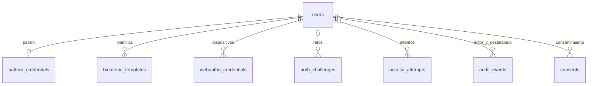

# Esquema implementado

Fuente: `database/schema.sql`, MySQL 8.4.7, InnoDB, UTF-8. Identificadores de cuenta ASCII normalizados a minúsculas. Fechas en UTC; la interfaz muestra UTC en el historial. `setup` crea una base nueva; no existe migración automática de datos de la entrega simulada del compañero.

| Tabla | Campos y finalidad | Restricciones relevantes |
|---|---|---|
| users | id BIGINT, identifier VARCHAR(100), name VARCHAR(150), role ENUM, active BOOLEAN, password_hash VARCHAR(255), webauthn_handle BINARY(32), session_version INT, created_at/updated_at DATETIME | identifier y handle únicos; roles Administrator/Gestor; hash opcional hasta provisionar recuperación |
| app_locks | id INT; fila 1 | Exclusión transaccional de cambios de administradores |
| pattern_credentials | id, user_id, pattern_hash VARCHAR(255), updated_at | Un registro por usuario; FK CASCADE |
| biometric_templates | id, user_id, modality ENUM face/voice, ciphertext MEDIUMBLOB, nonce BINARY(24), key_version VARCHAR(20), model_version/threshold_version VARCHAR(150), created_at | Único usuario/modalidad; FK CASCADE; cifrado autenticado, nunca se devuelve al cliente |
| webauthn_credentials | id, user_id, credential_id VARBINARY(1024), credential_digest BINARY(32), public_key TEXT, sign_count BIGINT, transports JSON, backup_eligible/backup_state BOOLEAN, created_at | Digest único de credential_id; FK CASCADE; sin huellas ni claves privadas |
| auth_challenges | id CHAR(64), user_id nullable, identifier_digest/session_binding CHAR(64), purpose/method ENUM, challenge VARBINARY(64), session_version nullable, expires_at/consumed_at/created_at | ID aleatorio, consumo bajo bloqueo; FK CASCADE; índice de vencimiento |
| access_attempts | id, user_id nullable, identifier_digest/ip_digest CHAR(64), method VARCHAR(20), outcome ENUM, reason_code VARCHAR(60), request_id CHAR(32), created_at | FK SET NULL; índices por cuenta/fecha y origen/fecha; HMAC para cuentas inexistentes e IP |
| audit_events | id, actor_id/target_user_id nullable, action VARCHAR(80), request_id CHAR(32), created_at | FK SET NULL; acciones sin secretos ni medios |
| consents | id, user_id, modality ENUM face/voice, notice_version VARCHAR(30), granted_at/withdrawn_at nullable | FK CASCADE; historial de consentimiento; retiro elimina plantilla |

Las claves de plantillas y HMAC residen en `.env`, fuera de MySQL y Git. La cuenta SQL de la aplicación no tiene DDL. No hay ruta de borrar usuario en la API: se desactiva y se revocan sus credenciales; CASCADE define integridad para tareas locales autorizadas y pruebas.

`app_locks` no tiene FK: representa un bloqueo global del conjunto de administradores. La API también comprueba roles, rangos, límites y modalidad; no depende solo del esquema.
